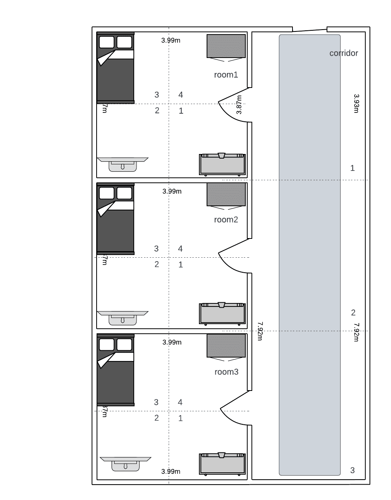

# MIW: [Prolog Project](./project.pl) Documentation

## 1. Map

## 2. Documentation

### Navigation

The map consists of 4 rooms, 3 bedrooms, and one corridor. The bedrooms are divided into 4 tiles, while the corridor has 3. The numbering of the tiles is described on the map.

- `go(Room)` $-$ a predicate used for moving between rooms, rooms must be connected by doors.

- `walk(Tile)` $-$ a predicate used for navigating within a room.

- `doors` $-$ informs about the rooms that can be accessed at the moment using go(Room).

- `pwd` $-$ prints information about the current position on the map.

- `look` $-$ prints information about the furniture on the current tile.

- `look_above` $-$ prints information about the objects located on top of the furniture.

- `look_below` $-$ prints information about the objects located below the furniture.

- `traverse_room` $-$ automatic exploration of the room, stepping on all tiles and looking above and below the furniture.

- `pick_item` $-$ moves the lying object to the inventory. It first moves the object from the top, subsequent calls move the object from the bottom.

- `escape` $-$ the goal of the game, winning occurs after calling it in the corridor when the player has a crowbar in the inventory.

## 3. Execution

The easiest way to execute the project is to paste the [source](./project.pl) to the online [SWISH](https://swish.swi-prolog.org/) interpreter.
